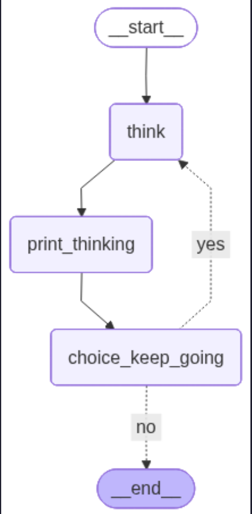

# Endless Workflow

this another workflow in [LongGraph](https://docs.langchain.com/oss/python/langgraph/workflows-agents) I called endless. in this workflow, After each model called, I ask my model to : do you want turn off yourself? and the answers is no always. so this is can be endless. this is not best practice to show it because it's better to use `stream` method to show AI message but I just want to show the logic of behind it.

